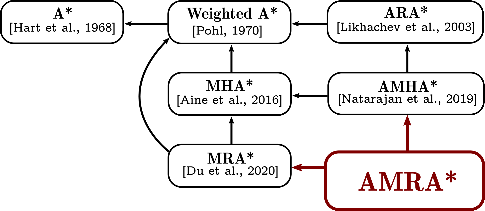

# AMRA*: Anytime Multi-Resolution Multi-Heuristic A*

This repository maintains open-source implementations of two anytime search-based planning algorithms. Currently, the following algorithms are available:

+ [AMRA\*: Anytime Multi-Resolution Multi-Heuristic A\*](https://arxiv.org/pdf/2110.05328.pdf) [Saxena et al., ICRA 2022]
+ [ARA\*: Anytime A\* with Provable Bounds on Sub-Optimality](https://proceedings.neurips.cc/paper/2003/file/ee8fe9093fbbb687bef15a38facc44d2-Paper.pdf) [Likhachev et al., NeurIPS 2003]

If you use `AMRA*`, please use the following citation:
```
@inproceedings{saxena2022amra,
  author={Saxena, Dhruv Mauria and Kusnur, Tushar and Likhachev, Maxim},
  booktitle={2022 IEEE International Conference on Robotics and Automation (ICRA)}, 
  title={AMRA*: Anytime Multi-Resolution Multi-Heuristic A*},
  year={2022}
}
```

## AMRA*
`AMRA*` is a general purpose search-based planning algorithm that combines three aspects of heuristic search algorithms into one algorithm.

1. *Multi-resolution search:* `AMRA*` searches multiple levels of state-space discretisation simultaneously, with each resolution having an associated action space.
2. *Anytime behaviour:* Given a high initial suboptimality bound, `AMRA*` is able to exploit the coarse resolutions to find the initial suboptimal solution quickly, and spend any remaining planning time budget improving it as it converges to the optimal solution.
3. *Multi-heuristic search:* `AMRA*` can also utilise guidance from multiple (potentially inadmissible) heuristics during the search. This can be useful as different heuristics may offer better guidance to the search in different parts of the search space, and one heuristic can help escape the local minima of another heuristic.

Under different operating modes, `AMRA*` can devolve into several existing heuristic search algorithms. The diagram below shows the "inheritance" relationship between these algorithms. Feel free to reach out via email to discuss these relationships and how the code may need to be modified to run any of these algorithms.

<p align="center">

</p>

## Usage

### Dependencies
The repository has the following dependecies:
1. [Eigen](https://eigen.tuxfamily.org/index.php?title=Main_Page)
2. [Boost C++](https://www.boost.org/)
3. [OMPL](https://ompl.kavrakilab.org/) (for the `RRT*` baseline experiment)
  + The OMPL dependency can be ignored if you do not plan to run the [`ompl_run`](test/ompl_run.cpp) example.

A lot of utility functions have been borrowed from the [SMPL](https://github.com/aurone/smpl) repository by @aurone.

### Building
1. Clone the repository.
    ```
    git clone https://github.com/dhruvms/amra.git
    ```
2. Create build directory and compile.
    ```
    cd amra && mkdir build && cd build && cmake ../ && make -j`nproc`
    ```
    
### Running experiments
To run some of the experiments from the [paper](https://arxiv.org/pdf/2110.05328.pdf), you will need to fiddle around with the hardcoded [constants](src/amra/constants.cpp). In general, if running examples from the `build` directory, the command line syntax is `<executable> <map>`. To run `ARA*` instead of `AMRA*` you can call the `CreateARAStarSearch()` function instead of the `CreateSearch()` function. Initial suboptimality bounds and their decay schedules can be adjusted via the constructors of the `AMRAStar` and `ARAStar` classes.

* 2D Gridworld Planning
    ```
    ./run2d <mapname>
    ```
    - For example, `<mapname>` could be `../dat/Cauldron.map` or `../dat/culdesacs/culdesac_np_left_costs.map`.
    - To run a search for one of the cul-de-sac maps with non-uniform cell costs from the [culdesacs](dat/culdesacs/) directory, please set `COSTMAP = true` in the [constants](src/amra/constants.cpp) file and re-build the code before running the example.
    - Other constants let you control the number of resolutions to use (currently supported values for `NUM_RES` are `{1, 2, 3}`), the discretisation resolution for the two coarser resolutions (`MIDRES_MULT` and `LOWRES_MULT`), the connectedness of the 2D grid (`GRID` can be 4 or 8), including a Dubins (`DUBINS`) or backwards Dijkstra heuristic (`DIJKSTRA`).
    - The `SUCCESSIVE` constant controls whether an anytime search is run or not. If it is set to `true`, search efforts are not carried over between iterations and it starts a new search from scratch with the updated weights (see the implementation in the [AMRA\* code](src/amra/amra.cpp#L305)).
* RRT* for 2D Gridworlds
    ```
    ./ompl_run <mapname>
    ```
* 4D Kinodynamic Planning for UAVs
    ```
    ./runuav <mapname>
    ```
    - The `TURNING_RADIUS`, `MAX_VEL`, and `WP_TIME` constants are relevant to this example and should not be changed.
    - `NUM_RES` must be set to 2 since the motion primitives only exist at two different resolutions (3m and 9m). For this reason, `MIDRES_MULT` must be set to 3, and `LOWRES_MULT` must be set to 9.
    
### Visualisation
- The [plotsolve](scripts/plotsolve.py) script can help visualise the behaviour of the heuristic search algorithms for 2D Gridworld Planning. As written, it assumes one heuristic used across all resolutions. If you add more heuristics you will need to edit the `qnames` variable.
  + The script takes as input the mapname for which you are plotting images, and optionally the start and goal coordinates for that run.
  + Prior to running a new experiment for which you want to save images, you will need to clear the (expansions)[dat/expansions/] and (solutions)[dat/solutions/] directories.
- The [plot_uav_solve](scripts/plot_uav_solve.py) script for visualising 4D planning results is very rigid in the way its written. It assumes that along with the standard search with two resolutions, both the Dubins and Dijkstra heuristics are being used at those two resolutions.
    
**Maintained by** : [Dhruv Mauria Saxena](mailto:dhruvmsaxena@gmail.com)
